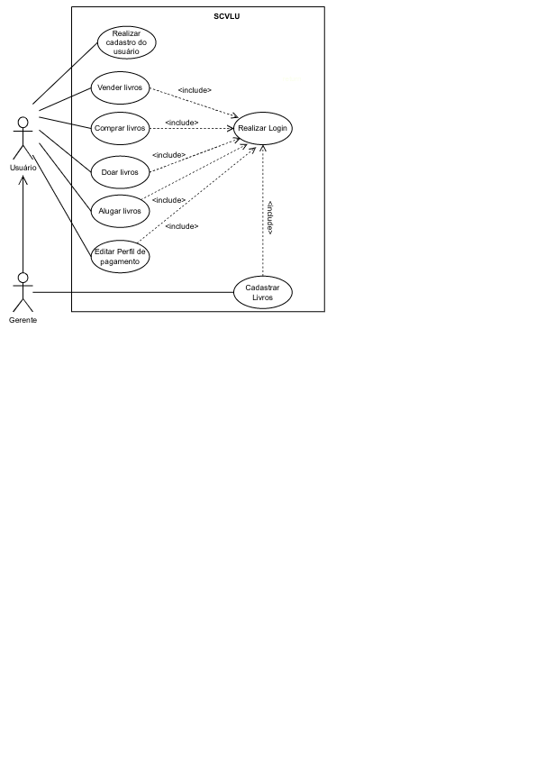

# Descrições dos casos de uso

## 1 - Realizar cadastro no aplicativo:

1. O ator (usuário) abre o aplicativo
2. O sistema exibe uma tela de login com as opções 'login' ou 'registrar-se'
3. O usuário seleciona a opção 'registrar'
4. O sistema solicita dados do usuário
5. O usuário informa os dados solicitados
6. O sistema persiste o cadastro
7. O sistema emite uma mensagem confirmando a realização do cadastro do usuário

## 2 - Realizar login no aplicativo:

1. Este fluxo inicia-se com o ator (usuário ou gerente) na tela de login
2. O sistema exibe uma tela com as opções 'login' ou 'registrar-se'
3. O ator seleciona a opção 'login'
4. O sistema solicita o e-mail do usuário e senha
5. O ator informa os dados solicitados
6. Caso os dados informados estejam corretos, o sistema realiza o login do ator

## 3 - Registrar livros para doação ou aluguel:

1. Este fluxo inicia-se com o ator (gerente) logado no aplicativo
2. Na tela inicial, o sistema exibe a opção 'cadastrar livros' 
3. O gerente seleciona a opção 'cadastrar livros'
4. O sistema solicita os dados do livros (se são livros para doação ou venda, preço, imagem, título e quantidade)
5. O gerente informa os dados solicitados
6. O sistema persiste o cadastro
7. O sistema emite uma mensagem confirmando a realização do cadastro do livro

## 4 - Doar ou vender livros:

1. Este fluxo inicia-se com o ator (usuário) logado no aplicativo
2. Na tela inicial, o sistema exibe as opções 'comprar livros', 'doar livros', 'vender livros', 'alugar livros'
3. Caso o usuário escolha a opção 'doar livros', o sistema solicita os dados do livro (imagem, título e quantidade). Caso o usuário escolha a opção 'vender livros', o sistema solicita os dados do livro (preço, imagem, título e quantidade e se é novo ou usado)
5. O usuário informa os dados solicitados
6. O sistema persiste o cadastro
7. O sistema emite uma mensagem confirmando a realização do cadastro do livro

## 5 - Comprar livros:

1. Este fluxo inicia-se com o ator (usuário) logado no aplicativo
2. Na tela inicial, o sistema exibe as opções 'comprar livros', 'doar livros', 'vender livros', 'alugar livros'
3. Caso escolha a opção 'comprar livros', o sistema exibe na tela alguns dos últimos livros cadastrados. Também exibe uma aba para que o usuário possa pesquisar um livro por nome
4. O usuário clica em um livro através da tela de seleção
5. O sistema mostra os dados do livro e disponibiliza a opção 'adicionar ao carrinho'
6. O usuário seleciona a quantidade desejada do exemplar e clica em 'adicionar ao carrinho'
7. O sistema exibe a mensagem 'ir para o carrinho'
8. O usuário seleciona a opção 'ir para o carrinho'
9. No carrinho, o usuário confirma a compra e insere dados de pagamento
10. O sistema valida os dados de pagamento 
11. O sistema exibe uma mensagem confirmando a compra do livro
12. O sistema notifica o gerente e o vendedor que uma compra foi realizada
13. O sistema retira o livro do aplicativo, caso não haja quantidade suficiente em estoque

## 6 - Alugar livros:

1. Este fluxo inicia-se com o ator (usuário) logado no aplicativo
2. Na tela inicial, o sistema exibe as opções 'comprar livros', 'doar livros', 'vender livros', 'alugar livros'
3. Caso escolha a opção 'alugar livros', o sistema exibe na tela alguns dos últimos livros disponíveis para aluguel. Também exibe uma aba para que o usuário possa pesquisar um livro por nome
4. O usuário clica em um livro através da tela de seleção
5. O sistema mostra os dados do livro e disponibiliza a opção 'alugar'
6. O usuário seleciona a opção 'alugar'
7. O sistema exibe uma tela para que o usuário confirme o livro escolhido e possa realizar o pagamento.
Caso o usuário tenha selecionado uma quantidade de livros maior que a quantidade permitida, o sistema exibe uma mensagem e pede que alguns livros sejam removidos.
9. No tela de confirmação e pagamento, o usuário confirma a compra e insere dados de pagamento
10. O sistema valida os dados de pagamento 
11. O sistema exibe uma mensagem confirmando o aluguel do livro
12. O sistema notifica o gerente e o vendedor que um aluguel foi realizado
13. O sistema retira o livro da aplicativo, caso não haja quantidade suficiente disponível em estoque

## 7 - Editar perfil:

1. Este fluxo inicia-se com o ator (usuário ou gerente) logado no aplicativo e estando na página 'Meu perfil'
2. O sistema exibe os dados do usuário e disponibiliza a opção 'Editar perfil'
3. O ator seleciona a opção 'Editar perfil'
4. O sistema permite que os dados do ator sejam modificados
5. O ator modifica os dados que queira modificar e clica em 'salvar alterações'
6. O sistema persiste os novos dados
7. O sistema exibe uma mensagem de que os dados foram atualizados

## 8 - Recuperar senha:

1. Este fluxo inicia-se com o ator (usuário ou gerente) na tela de login
2. O sistema exibe uma tela com as opções 'login' ou 'registrar-se'
3. O ator seleciona a opção 'login'
4. O sistema solicita o e-mail do usuário e senha e também disponibiliza a opção 'recuperar senha'
5. O ator seleciona a opção 'recuperar senha'
6. O sistema solicita o  e-mail do ator
7. O ator insere um dos dados solicitado e clica em 'enviar'
8. O sistema exibe uma mensagem de que um link para redefinição de senha foi enviado para o e-mail cadastrado
9. O sistema envia para o e-mail cadastrado um link para redefinição de senha

# Modelo de Caso de Uso

