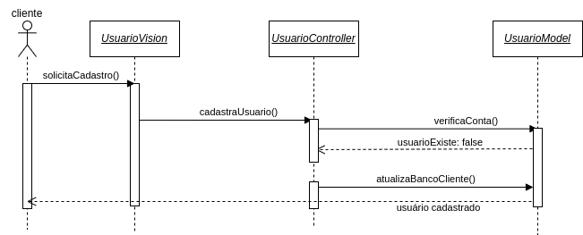
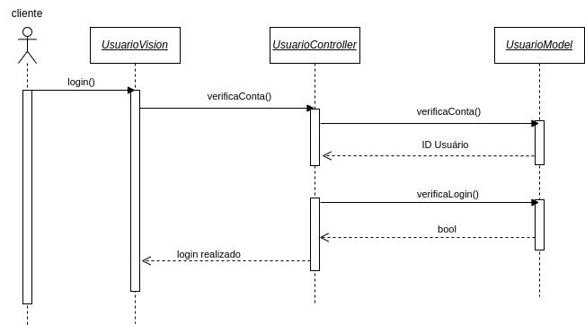
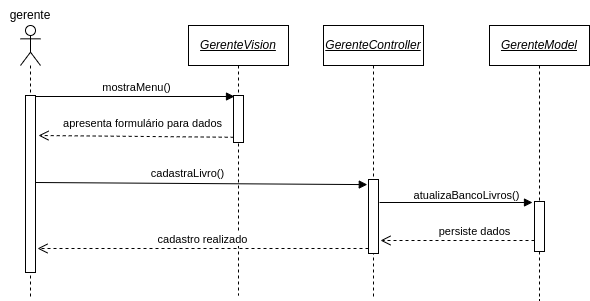
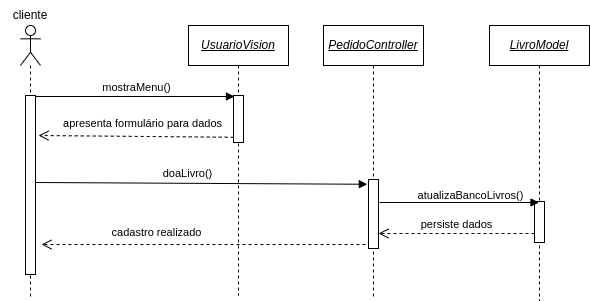
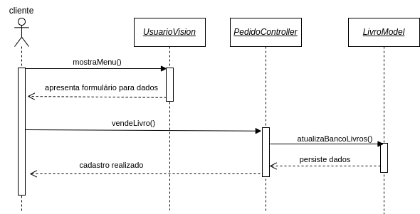
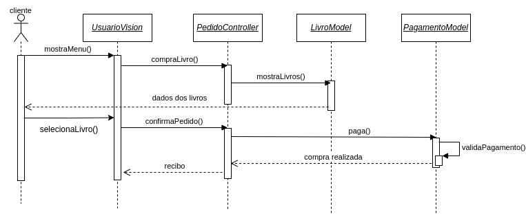
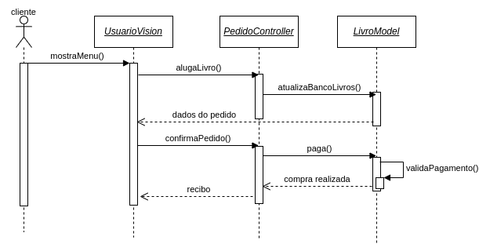
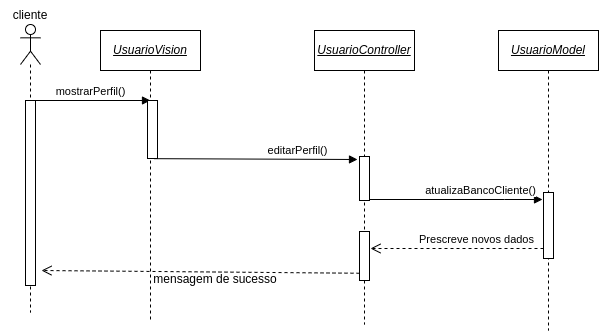
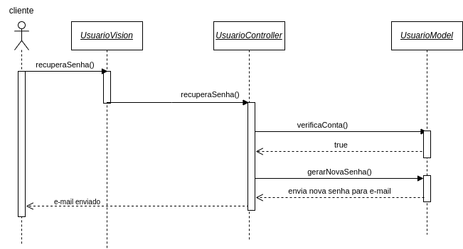

# Diagrama de Sequência

## 1 - Realizar cadastro no aplicativo:

## 2 - Realizar login no aplicativo:

## 3 - Registrar livros para doação ou aluguel:

## 4 - Doar ou vender livros:

## 5 - Comprar livros:

## 6 - Alugar livros:

## 7 - Editar perfil:

## 8 - Recuperar senha:

